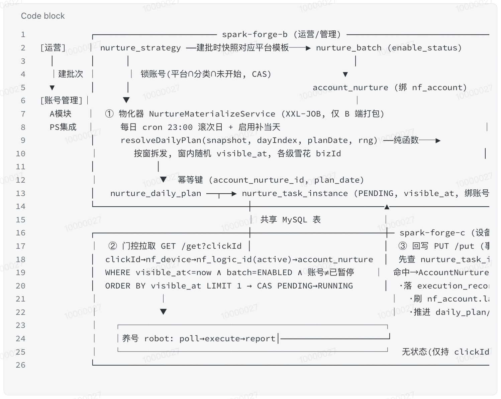
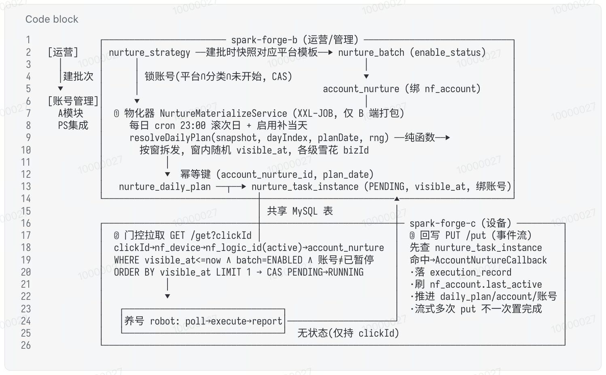

# 飞书代码块 ASCII 图对齐修复

[](https://raw.githubusercontent.com/amzyang/gadgets/main/feishu-codeblock-mono-fix/feishu-codeblock-mono-fix.user.js)

把飞书文档 / Wiki 代码块的字体替换为「与终端 wcwidth 网格一致」的等宽字体，让用 box-drawing 字符（`─│┌┐└┘┼▶▼`）+ 中文画的 ASCII 架构图，在网页上像终端里一样**逐像素对齐**。

## 效果对比

| 修复前（中英错位 · 右边框锯齿 · 竖线断裂） | 修复后（零像素偏差 · 框线闭合） |
| :---: | :---: |
|  |  |

## 依赖

| 依赖 | 作用 | 必需 |
| --- | --- | :---: |
| **Tampermonkey** / Violentmonkey | 用户脚本管理器，运行本脚本 | ✅ |
| **Sarasa Term SC**（更纱黑体·终端） | 零偏差的关键字体：中文 2 格、歧义宽度符号 1 格，与终端一致 | ✅ |
| Sarasa Fixed SC / Sarasa Mono SC | 字体栈退路（脚本已内置回退顺序） | ⬜ |

### macOS 安装字体（Homebrew）

```bash
brew install --cask font-sarasa-gothic
```

装好后字体库即含 `Sarasa Term SC` / `Sarasa Fixed SC` / `Sarasa Mono SC`。脚本字体栈优先用 **Term / Fixed**（歧义符号按 1 格 → 零偏差）；只有 `Sarasa Mono SC` 时仍能 2:1 对齐，但 `→ ▶ ①` 会偏 1 格（≈7px）。

> 验证已安装：`ls ~/Library/Fonts | grep -i sarasa` 或「字体册」搜索 Sarasa。
> 其他平台：从 [be5invis/Sarasa-Gothic Releases](https://github.com/be5invis/Sarasa-Gothic/releases) 下载 `Sarasa Term SC` 安装。

## 安装脚本

1. 先装好 [Tampermonkey](https://www.tampermonkey.net/) 与 Sarasa 字体（见上）。
2. 点上方 **Click to Install** 徽章 → Tampermonkey 自动弹出安装页 → 确认安装。
3. 刷新飞书文档即可。脚本带 `@updateURL`，后续版本更新会自动拉取。

## 它修复了什么

飞书代码块用的是 `SourceCodeProMac`——**只含拉丁的等宽字体，字体栈里没有任何中文字体**。在它下面实测逐字步进宽度：

| 字符类 | 相对 ASCII 宽度 | ASCII 图/终端的假设 |
| --- | --- | --- |
| ASCII / box-drawing | 1.0 | 1 格 ✓ |
| **中文** | **1.667** | **2 格** ✗ |
| 歧义宽度符号 `→ ▶ ① ` | 2.0（CJK 字体下） | 1 格 ✗ |

- **主因**：中文宽度是 ASCII 的 1.667 倍而非 2 倍（中文 fallback 到全角 PingFang，1.0em ÷ 拉丁 0.6em）。图按「中文 = 2 个英文格」绘制，于是每个中文把后面内容左拽 ≈2.8px，**右边框逐行累计错位最高 ~36px（≈5 格锯齿）**。
- **像素级残差**：图里大量用 `→`（及 `▶▼▲①②③`），这些是东亚 *Ambiguous* 宽度字符——终端按 1 格、多数 CJK 字体按 2 格。

**为什么终端好、网页坏**：终端（kitty 等）对齐**靠等宽字符网格、不靠字体**——它按 east-asian-width 强制中文占 2 cell、歧义符号占 1 cell。浏览器按字形 advance 比例排版、没有网格，所以必须换一款「每类字符 advance 恰好等于终端格数」的字体才能复刻。

## 原理：为什么是 Sarasa Term / Fixed

| 字符 | Sarasa **Mono** SC | **Sarasa Term / Fixed SC** | kitty 终端 |
| --- | :---: | :---: | :---: |
| `→ ▶ ▼ ▲ ① ② ③`（歧义宽度）| 2 格 ✗ | **1 格 ✓** | 1 格 |
| 中文 | 2 格 | 2 格 | 2 格 |
| ASCII / box-drawing | 1 格 | 1 格 | 1 格 |

只有 **Term / Fixed 变体**把歧义宽度符号按 1 格渲染，每一类字符的格数都与终端一致 → 零偏差。实测顶部外框右边框逐行 x 坐标极差：**默认 33.6px → Sarasa Mono SC 7px → Sarasa Term SC 0px**。

脚本核心（作用域严格限定在 `.code-block-zone-container` 内，不动正文）：

```css
.code-block-zone-container, .code-block-zone-container .ace-line,
.code-block-zone-container [data-string] {
  font-family: 'Sarasa Term SC','Sarasa Fixed SC','Sarasa Mono SC',monospace !important;
  letter-spacing: 0 !important;
  font-feature-settings: "liga" 0, "calt" 0 !important;
}
.code-block-zone-container .ace-line { line-height: 1.2 !important; }
```

## 可调项

- **行高**：`1.2` 接近终端、竖线连实；嫌挤可调到 `1.45`。
- **范围**：默认 `@match https://*.feishu.cn/*` 作用于所有飞书代码块（顺带修复所有含中文注释的代码对齐）。
- **彻底无依赖**：若不想装字体，也可把源文里的 `→▶▼▲①②③` 换成 ASCII（`->`、`>`、`v`、`^`、`(1)`…），这些是无歧义 1 格字符，任何 2:1 等宽字体都能零偏差。

## 限制

- **只对装了脚本的浏览器生效**：同事打开同一篇文档仍是错位的。要让所有人都正常，须改源（转图片 / 飞书原生流程图）。
- **编辑模式**：改了 `line-height`，飞书编辑态的光标/选区高亮浮层可能与文字轻微错位（按行高算坐标）。纯查看无影响；编辑别扭就删掉脚本里 `line-height` 那一行。
